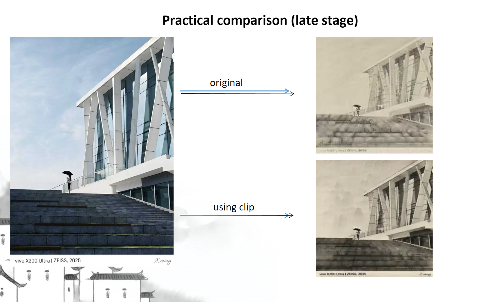
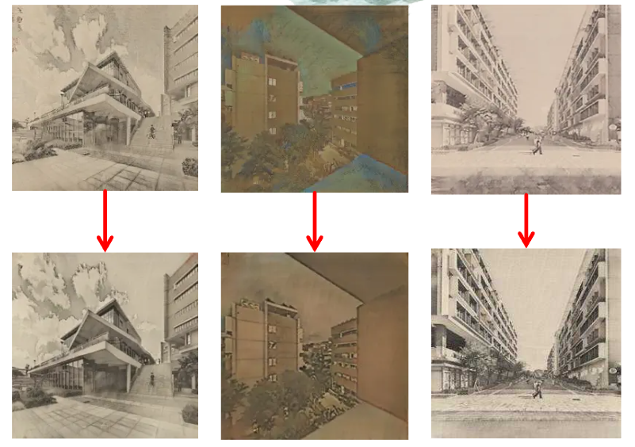
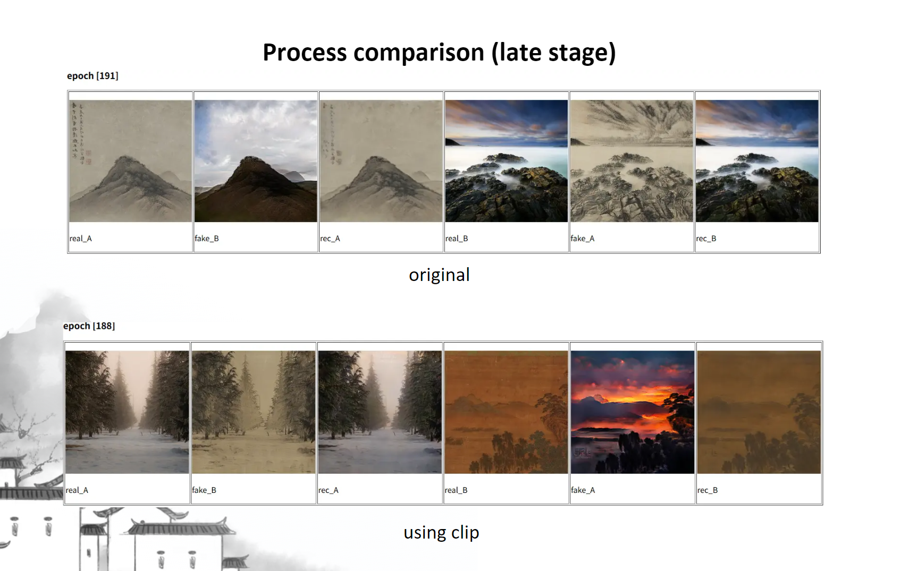
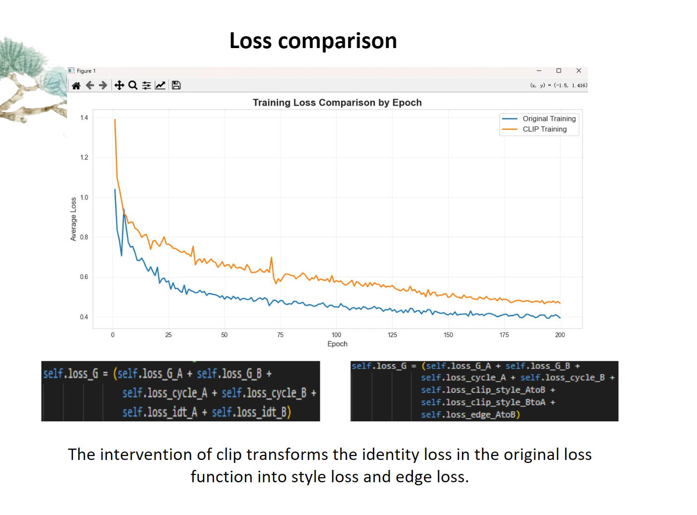

# Chinese Ink Style Transformer based on CycleGAN & CLIP

This is a style transfer project based on **CycleGAN**, designed to transform natural landscape photos into **Chinese ink painting style**.

This project innovates upon the traditional CycleGAN architecture by introducing **CLIP (Contrastive Language-Image Pre-training)** as part of the semantic loss function. This improvement significantly enhances training efficiency and generation quality, while providing the model with stronger semantic extensibility.

## ✨ Key Features

- **CLIP Semantic Consistency**: Unlike traditional CycleGAN that relies solely on adversarial loss and cycle consistency loss, this project leverages CLIP's powerful image-text matching capability to incorporate natural language descriptions into the loss calculation.
- **Improved Training Efficiency**: The semantic supervision provided by CLIP accelerates the convergence process.
- **Better Fidelity**: Generated images perform better in preserving the original structure and semantic information, with reduced artifacts.
- **High Extensibility**: By modifying CLIP prompts, you can easily adjust the semantic tendency of the generated style without major modifications to the model architecture.
- **Web Interactive Interface**: Provides a simple front-end application to upload images and view conversion results directly in the browser.

## 🖼️ Results

We compared the effects of the original CycleGAN with the model enhanced by CLIP semantic loss.

### 1. Style Transfer Overview
Whether it's modern architecture or natural landscapes, the model can effectively capture the brushstrokes and artistic conception of ink paintings.




### 2. Practical Comparison
In the later stages of training, the CLIP-enhanced model significantly outperforms the original method in detail texture and overall style consistency.



### 3. Process Comparison

#### Early Stage (Epoch 14)
In the early stages of training, the CLIP-enhanced model already begins to show clearer outlines and more accurate color distribution.


#### Late Stage (Epoch 188-191)
As training progresses, the baseline model (Original) tends to produce blurry or color-distorted results, while the CLIP-enhanced model generates clearer and more artistic images.



#### Data Visualization - Loss Function
To be analyzed




## 💻 Web Demo

This project provides a web-based graphical interface for users to upload their own images for style conversion.

### How to Start
Simply run `app.py` in the terminal to start the service:

```bash
python app.py
```

After starting, visit the local address displayed in the terminal (usually `http://127.0.0.1:5000`) in your browser to upload images and view the converted ink painting results in real-time.

## 🛠️ Getting Started

### Prerequisites
- Python 3.x
- PyTorch
- CLIP (OpenAI)
- Flask (for Web front-end)
- For other dependencies, please refer to `environment.yml` or `requirements.txt`

```bash
pip install -r requirements.txt
# Or use conda
conda env create -f environment.yml
```

### Training

Use the `train.py` script to start training.

```bash
# Train the base model
python train.py --dataroot ./datasets/your_dataset --name experiment_name --model cycle_gan

# Train with CLIP loss enabled (adjust parameters as needed)
python train.py --dataroot ./datasets/your_dataset --name experiment_clip --model cycle_gan --use_clip_loss
```

## 📂 Dataset

Please organize your dataset according to the following structure:
```
datasets/
    your_dataset/
        trainA/  # Natural landscape images
        trainB/  # Ink painting images
        testA/
        testB/
```

## 🙏 Acknowledgements

This project is developed based on [pytorch-CycleGAN-and-pix2pix](https://github.com/junyanz/pytorch-CycleGAN-and-pix2pix). Thanks to the original authors for their open-source contribution.
We also thank OpenAI for open-sourcing the CLIP model, which provides the core semantic guidance capability for this project.
